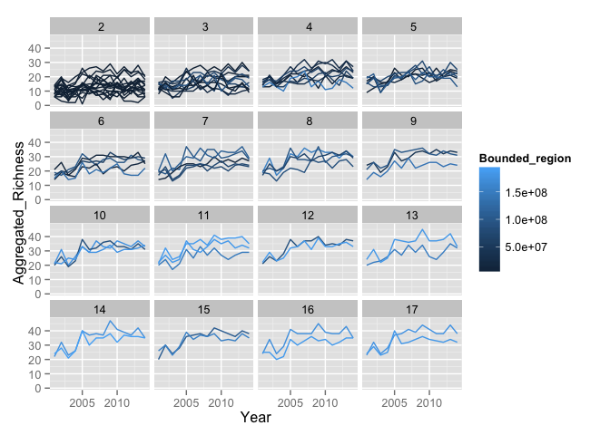

    #Load methods for dealing with data
    source("./R/dataGenerationFunctions.R")

    ## Warning: package 'dplyr' was built under R version 3.1.2

    ## 
    ## Attaching package: 'dplyr'
    ## 
    ## The following objects are masked from 'package:plyr':
    ## 
    ##     arrange, count, desc, failwith, id, mutate, rename, summarise,
    ##     summarize
    ## 
    ## The following object is masked from 'package:MASS':
    ## 
    ##     select
    ## 
    ## The following object is masked from 'package:stats':
    ## 
    ##     filter
    ## 
    ## The following objects are masked from 'package:base':
    ## 
    ##     intersect, setdiff, setequal, union
    ## 
    ## rgeos version: 0.3-8, (SVN revision 460)
    ##  GEOS runtime version: 3.4.2-CAPI-1.8.2 r3921 
    ##  Polygon checking: TRUE 
    ## 
    ## rgdal: version: 0.9-1, (SVN revision 518)
    ## Geospatial Data Abstraction Library extensions to R successfully loaded
    ## Loaded GDAL runtime: GDAL 1.11.1, released 2014/09/24
    ## Path to GDAL shared files: /usr/local/share/gdal
    ## Loaded PROJ.4 runtime: Rel. 4.8.0, 6 March 2012, [PJ_VERSION: 480]
    ## Path to PROJ.4 shared files: (autodetected)

    #Load the fish data
    fish <- read.csv("./data/rawData_SBCfish.csv")
    fish <- subset(fish, fish$Year!=2000) #too much variation in this year

So, there are differences in \# of years sampled from site to site and
we want the core set that was sampled in all years filter to sites that
are in the whole dataset

    fishSamples <- fish %>% group_by(Latitude, Longitude, Year) %>%
      summarise(n=n()) %>% ungroup() %>% 
      group_by(Latitude, Longitude) %>%
      summarise(nYearsSampled=n()) %>% 
      ungroup() %>%
      filter(nYearsSampled==max(nYearsSampled))

    fishSamples$SampleID <- 1:nrow(fishSamples)
      
    #use inner_join to filter down to those sites only
    fish <- inner_join(fish, fishSamples)

    ## Joining by: c("Latitude", "Longitude")

    #we'll need this later
    nplots <- length(unique(paste(fish$Latitude, fish$Longitude)))

Create a simulated data set where for every scale, there are the same
number of observations (total number of transects) and plot it relative
to different predictors on the X-axis

Note, getSubData takes the following arguments: dataset - the name of a
dataset nplots - total number of unique plots n - the number of plots
that will be used to create a n plot set noSpecies="-99999"- the code in
the dataset for no species being in a plot uniquePerms=T - Only create
unique permutations where no plots are shared within set of plots
(sampling without replacement)

Look at it!

    library(ggplot2)

    ## Warning: package 'ggplot2' was built under R version 3.1.3

    qplot(Year, Aggregated_Richness, data=simData, group=SampleID, 
          geom="line", color=Bounded_region, facets=~Scale)

    qplot(Scale, Aggregated_Richness, data=simData, group=Year, 
          geom="point",size=I(0), color=Year) +
      stat_smooth(fill=NA)

    qplot(Bounded_region, Aggregated_Richness, data=simData, group=SampleID, 
          geom="point", color=Scale, facets=~Year)

And a sample analysis - although this will get better, right Forest?

    library(lme4)

    ## Loading required package: Matrix
    ## Loading required package: Rcpp

    ## Warning: package 'Rcpp' was built under R version 3.1.3

    library(lmerTest)

    ## KernSmooth 2.23 loaded
    ## Copyright M. P. Wand 1997-2009
    ## 
    ## Attaching package: 'lmerTest'
    ## 
    ## The following object is masked from 'package:lme4':
    ## 
    ##     lmer
    ## 
    ## The following object is masked from 'package:stats':
    ## 
    ##     step

    #We want to do this, but it won't converge
    #mod.full <- lmer(Aggregated_Richness ~ Year*Scale*Bounded_region +
    #                   (1+ Year*Scale*Bounded_region|sampleID),
    #                 data=simData)

    #instead we do this
    mod.novarslope.ranef<- lmer(Aggregated_Richness ~ Year*log(Scale)*Bounded_region +
                                       (1+log(Scale)|SampleID),
                                     data=simData)

    ## Warning: Some predictor variables are on very different scales: consider
    ## rescaling

    summary(mod.novarslope.ranef)

    ## Warning: Some predictor variables are on very different scales: consider
    ## rescaling

    ## Warning: Some predictor variables are on very different scales: consider
    ## rescaling

    ## Linear mixed model fit by REML ['merModLmerTest']
    ## Formula: Aggregated_Richness ~ Year * log(Scale) * Bounded_region + (1 +  
    ##     log(Scale) | SampleID)
    ##    Data: simData
    ## 
    ## REML criterion at convergence: 6283.9
    ## 
    ## Scaled residuals: 
    ##     Min      1Q  Median      3Q     Max 
    ## -3.2173 -0.6718 -0.0367  0.6492  2.9380 
    ## 
    ## Random effects:
    ##  Groups   Name        Variance Std.Dev. Corr 
    ##  SampleID (Intercept) 25.911   5.090         
    ##           log(Scale)   2.789   1.670    -0.87
    ##  Residual             13.532   3.679         
    ## Number of obs: 1092, groups:  SampleID, 78
    ## 
    ## Fixed effects:
    ##                                  Estimate Std. Error         df t value
    ## (Intercept)                     1.125e+02  2.017e+02  1.010e+03   0.558
    ## Year                           -5.325e-02  1.004e-01  1.010e+03  -0.530
    ## log(Scale)                     -9.749e+02  1.697e+02  1.010e+03  -5.745
    ## Bounded_region                  7.938e-06  3.581e-06  1.010e+03   2.217
    ## Year:log(Scale)                 4.907e-01  8.454e-02  1.010e+03   5.805
    ## Year:Bounded_region            -3.964e-09  1.784e-09  1.010e+03  -2.222
    ## log(Scale):Bounded_region      -1.765e-06  1.530e-06  1.010e+03  -1.153
    ## Year:log(Scale):Bounded_region  8.831e-10  7.624e-10  1.010e+03   1.158
    ##                                Pr(>|t|)    
    ## (Intercept)                      0.5770    
    ## Year                             0.5962    
    ## log(Scale)                     1.22e-08 ***
    ## Bounded_region                   0.0269 *  
    ## Year:log(Scale)                8.63e-09 ***
    ## Year:Bounded_region              0.0265 *  
    ## log(Scale):Bounded_region        0.2492    
    ## Year:log(Scale):Bounded_region   0.2470    
    ## ---
    ## Signif. codes:  0 '***' 0.001 '**' 0.01 '*' 0.05 '.' 0.1 ' ' 1
    ## 
    ## Correlation of Fixed Effects:
    ##             (Intr) Year   lg(Sc) Bndd_r Yr:(S) Yr:Bn_ l(S):B
    ## Year        -1.000                                          
    ## log(Scale)  -0.908  0.908                                   
    ## Bounded_rgn -0.208  0.208  0.005                            
    ## Yer:lg(Scl)  0.908 -0.908 -1.000 -0.005                     
    ## Yr:Bndd_rgn  0.208 -0.208 -0.005 -1.000  0.005              
    ## lg(Scl):Bn_  0.492 -0.492 -0.399 -0.894  0.399  0.894       
    ## Yr:lg(S):B_ -0.492  0.492  0.399  0.894 -0.399 -0.894 -1.000
